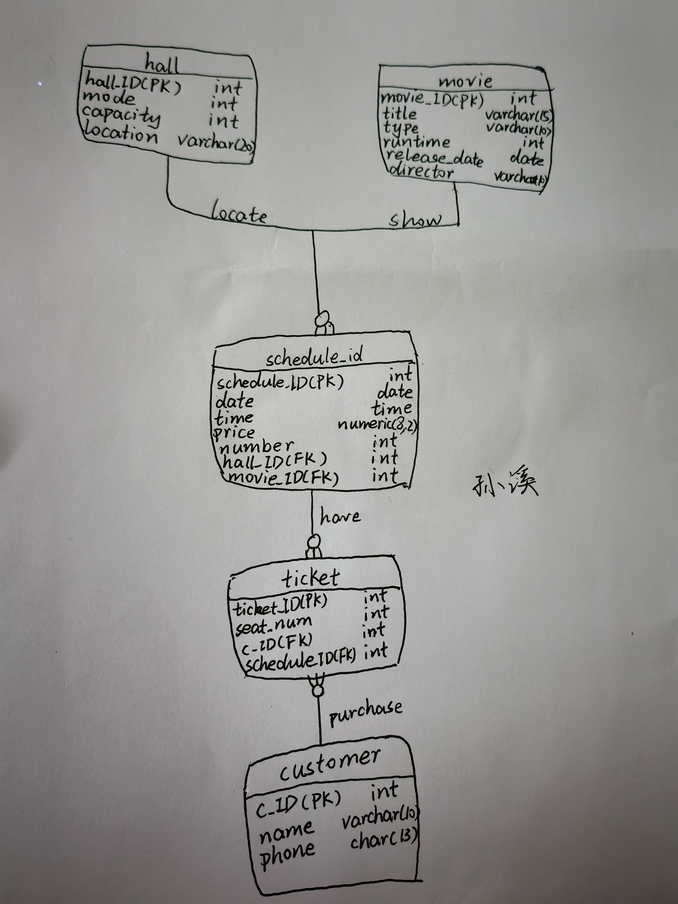

1. 从概念模型到OpenGauss实现
```postgresql
 # 请将你实现flight_booking数据库的语句写在下方：
-- DROP DATABASE IF EXISTS flight_booking;

-- CREATE DATABASE flight_booking;

\c flight_booking;

CREATE TABLE user (
     user_id SERIAL PRIMARY KEY,
     firstname VARCHAR(50) NOT NULL,
     lastname VARCHAR(50) NOT NULL,
     dob DATE NOT NULL,
     sex CHAR(1) NOT NULL,
     email VARCHAR(50),
     phone VARCHAR(30),
     username VARCHAR(20) NOT NULL UNIQUE,
     password CHAR(32) NOT NULL,
     admin_tag BOOLEAN DEFAULT false NOT NULL
);

CREATE TABLE passenger (
     passenger_id SERIAL PRIMARY KEY,
     id CHAR(18) NOT NULL UNIQUE,
     firstname VARCHAR(50) NOT NULL,
     lastname VARCHAR(50) NOT NULL,
     mail VARCHAR(50),
     phone VARCHAR(20) NOT NULL,
     sex CHAR(1) NOT NULL,
     dob DATE
);

CREATE TABLE airport (
     airport_id SERIAL PRIMARY KEY,
     iata CHAR(3) NOT NULL UNIQUE,
     icao CHAR(4) NOT NULL UNIQUE,
     name VARCHAR(50) NOT NULL,
     city VARCHAR(50),
     country VARCHAR(50),
     latitude NUMERIC(11, 8),
     longitude NUMERIC(11, 8),

     INDEX(name)
);

CREATE TABLE airline (
     airline_id SERIAL PRIMARY KEY,
     name VARCHAR(30) NOT NULL,
     iata CHAR(2) NOT NULL UNIQUE,

     airport_id INTEGER NOT NULL,

     FOREIGN KEY(airport_id) REFERENCES airport(airport_id)
);

CREATE TABLE airplane (
     airplane_id INTEGER PRIMARY KEY,
     type VARCHAR(50) NOT NULL,
     capacity SMALLINT NOT NULL,
     identifier VARCHAR(50) NOT NULL,

     airline_id INTEGER NOT NULL,

     FOREIGN KEY(airline_id) REFERENCES airline(airline_id)
);

create table flightschedule (
     flight_no char(8) primary key,
     departure time not null,
     arrival time not null,
     duration smallint not null,
     monday tinyint default 0,
     tuesday tinyint default 0,
     wednesday tinyint default 0,
     thursday tinyint default 0,
     friday tinyint default 0,
     saturday tinyint default 0,
     sunday tinyint default 0,

     airline_id int not null,
     `from` int not null,
     `to` int not null,

     foreign key(airline_id) references airline(airline_id),
     foreign key(`from`) references airport(airport_id),
     foreign key(`to`) references airport(airport_id)
);
CREATE TABLE flight (
     flight_id SERIAL PRIMARY KEY,
     departure TIMESTAMP NOT NULL,
     arrival TIMESTAMP NOT NULL,
     duration SMALLINT NOT NULL,

     airline_id INTEGER NOT NULL,
     airplane_id INTEGER NOT NULL,
     flight_no CHAR(8) NOT NULL,
     "from" INTEGER NOT NULL,
     "to" INTEGER NOT NULL,

     FOREIGN KEY(airline_id) REFERENCES airline(airline_id),
     FOREIGN KEY(airplane_id) REFERENCES airplane(airplane_id),
     FOREIGN KEY(flight_no) REFERENCES flightschedule(flight_no),
     FOREIGN KEY("from") REFERENCES airport(airport_id),
     FOREIGN KEY("to") REFERENCES airport(airport_id)
);

CREATE TABLE ticket (
     ticket_id SERIAL PRIMARY KEY,
     seat CHAR(4),
     price NUMERIC(10, 2) NOT NULL,

     flight_id INTEGER NOT NULL,
     passenger_id INTEGER NOT NULL,
     user_id INTEGER NOT NULL,

     FOREIGN KEY(flight_id) REFERENCES flight(flight_id),
     FOREIGN KEY(passenger_id) REFERENCES passenger(passenger_id),
     FOREIGN KEY(user_id) REFERENCES user(user_id)
);
```

2. 从需求分析到逻辑模型



以下给出关系模式：

顾客(c_ID, name, type, phone), primary key:(c_ID);

电影票(ticket_ID, seat_num, schedule_ID), primary key(ticket_ID), foreign key(schedule_ID);

排场(schedule_ID, date, time, price, number, movie_ID, hall_ID), primary key:(schedule_ID), foreign key(movie_ID, hall_ID);

放映厅(hall_ID, mode, capacity, location), primary key:(hall_ID);

电影(movie_ID, title, type, runtime, release_date, director, starring), primary key:(movie_ID);

3. 建模工具的使用

```postgresql
 # 请将利用MySQL Workbench软件的Modeling工具，经forward engineering 导出的创建schema的SQL语句完整粘到此处：
 
 /*==============================================================*/
/* DBMS name:      PostgreSQL 9.x                               */
/* Created on:     2022/12/8 3:38:28                            */
/*==============================================================*/


drop table apgroup;

drop table apmodule;

drop table apright;

drop table aprole;

drop table apuser;

/*==============================================================*/
/* Table: aprole                                                */
/*==============================================================*/
create table aprole (
   RoleNo               INT4                 not null,
   RoleName             CHAR(20)             not null,
   Comment              VARCHAR(50)          null default NULL,
   Status               INT2                 null default NULL,
   constraint PK_APROLE primary key (RoleNo)
);

comment on column aprole.RoleNo is
'角色编号';

comment on column aprole.RoleName is
'角色名';

comment on column aprole.Comment is
'角色描述';

comment on column aprole.Status is
'角色状态';

/*==============================================================*/
/* Table: apuser                                                */
/*==============================================================*/
create table apuser (
   UserID               CHAR(8)              not null,
   UserName             CHAR(8)              null default NULL,
   Comment              VARCHAR(50)          null default NULL,
   PassWord             CHAR(32)             null default NULL,
   Status               INT2                 null default NULL,
   constraint PK_APUSER primary key (UserID),
   constraint ind_username unique (UserName)
);

comment on column apuser.UserID is
'用户工号';

comment on column apuser.UserName is
'用户姓名';

comment on column apuser.Comment is
'用户描述';

comment on column apuser.PassWord is
'口令';

comment on column apuser.Status is
'状态';

/*==============================================================*/
/* Table: apgroup                                               */
/*==============================================================*/
create table apgroup (
   UserID               CHAR(8)              not null,
   RoleNo               INT4                 not null,
   constraint PK_APGROUP primary key (UserID, RoleNo),
   constraint FK_apGroup_apRole2 unique (RoleNo),
   constraint FK_apGroup_apRole foreign key (RoleNo)
      references aprole (RoleNo),
   constraint FK_apGroup_apUser foreign key (UserID)
      references apuser (UserID)
);

comment on column apgroup.UserID is
'用户编号';

comment on column apgroup.RoleNo is
'角色编号';

/*==============================================================*/
/* Table: apmodule                                              */
/*==============================================================*/
create table apmodule (
   ModNo                INT8                 not null,
   ModID                CHAR(10)             null default NULL,
   ModName              CHAR(20)             null default NULL,
   constraint PK_APMODULE primary key (ModNo)
);

comment on column apmodule.ModNo is
'模块编号';

comment on column apmodule.ModID is
'系统或模块的代码';

comment on column apmodule.ModName is
'系统或模块的名称';

/*==============================================================*/
/* Table: apright                                               */
/*==============================================================*/
create table apright (
   RoleNo               INT4                 not null,
   ModNo                INT8                 not null,
   constraint PK_APRIGHT primary key (RoleNo, ModNo),
   constraint FK_apRight_apModule2 unique (ModNo),
   constraint FK_apRight_apModule foreign key (ModNo)
      references apmodule (ModNo),
   constraint FK_apRight_apRole foreign key (RoleNo)
      references aprole (RoleNo)
);

comment on column apright.RoleNo is
'角色编号';

comment on column apright.ModNo is
'模块编号';
```

